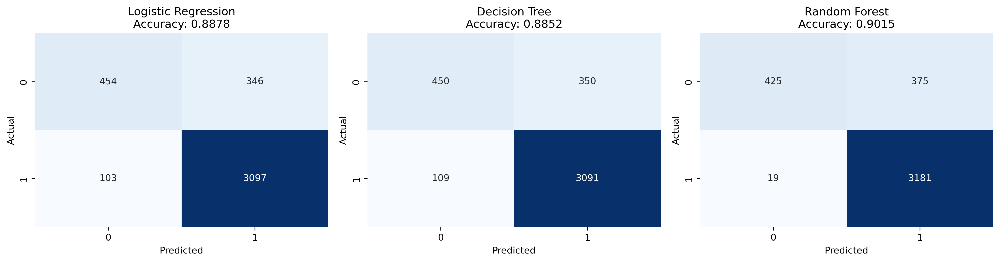
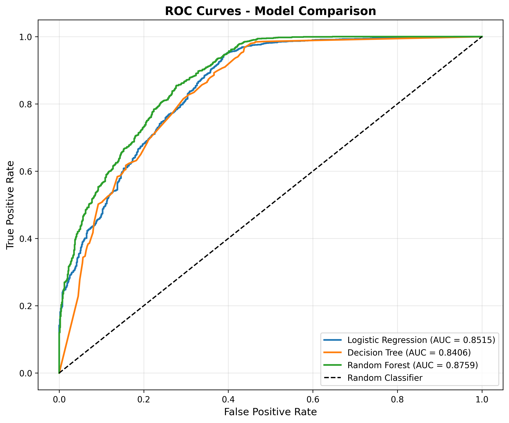
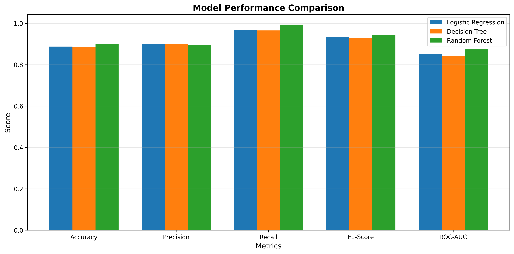
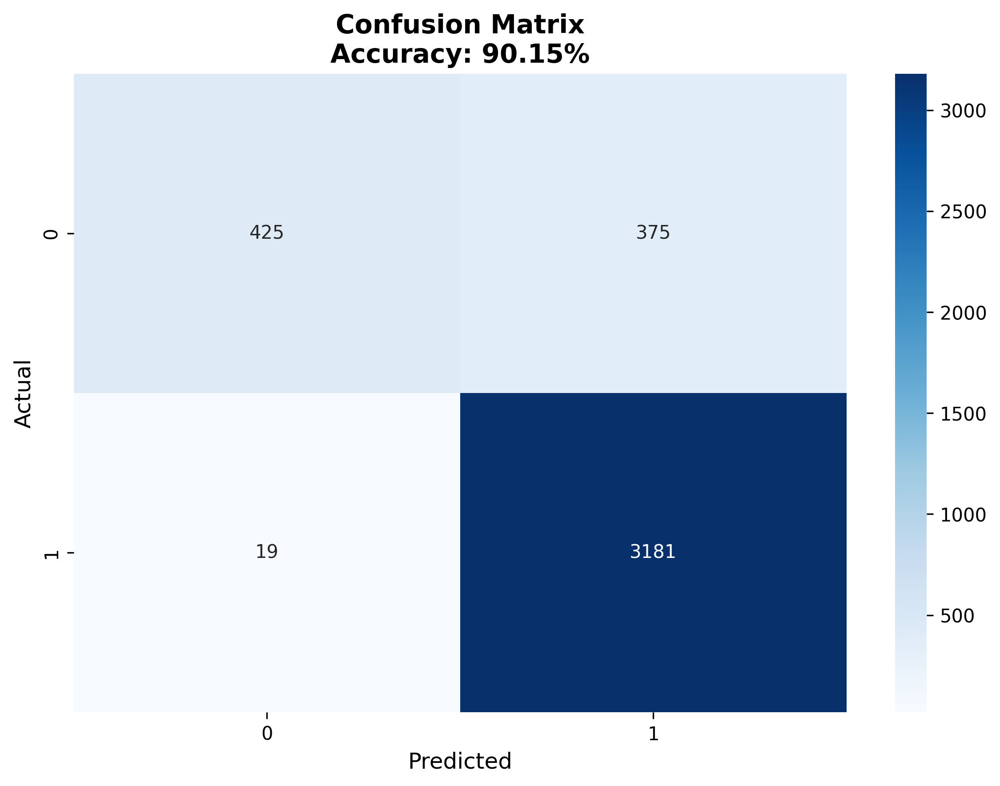
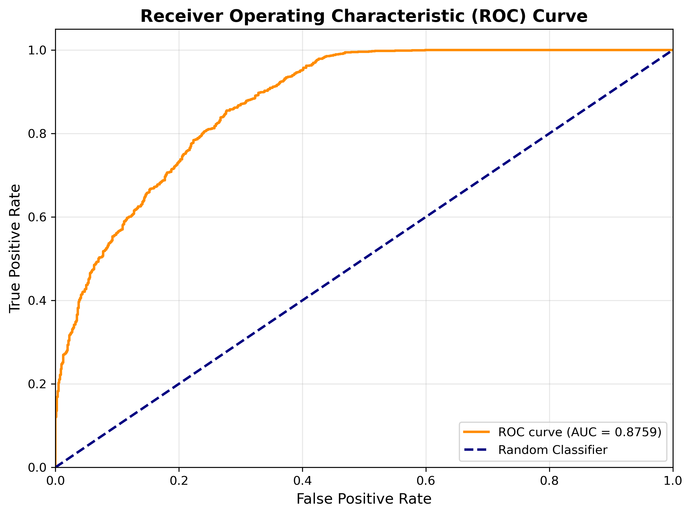
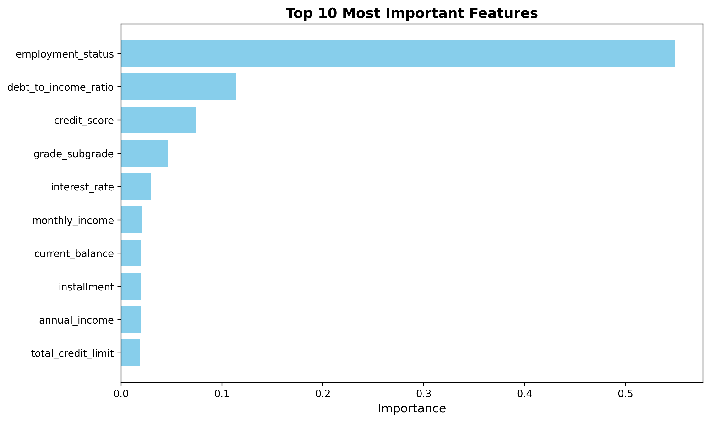

# Intelligent Credit Risk Scoring & Agentic Lending Decision Support

[](https://www.python.org/)
[](https://streamlit.io/)
[](https://scikit-learn.org/)
[](https://github.com/langchain-ai/langgraph)
[](LICENSE)

An end-to-end credit analytics system: **Milestone 1** uses classical machine learning to predict loan repayment with **90.15% accuracy**. **Milestone 2** extends this into an agentic AI lending advisor that autonomously reasons about borrower risk, retrieves financial regulations via RAG, and generates structured credit assessment reports.

 **[Live Demo](https://credit-riskscoring.streamlit.app)** |  **[GitHub Repository](https://github.com/officialravleensingh/credit-risk-scoring)**

---

## Table of Contents

- [Project Overview](#project-overview)
- [Milestone 1: ML Credit Risk Scoring](#milestone-1-ml-credit-risk-scoring)
- [Milestone 2: Agentic Lending Advisor](#milestone-2-agentic-lending-advisor)
- [Dataset](#dataset)
- [Model Performance](#model-performance)
- [Tech Stack](#tech-stack)
- [Installation](#installation)
- [Usage](#usage)
- [Project Structure](#project-structure)
- [Team](#team)

---

## Project Overview

Financial institutions face significant challenges in evaluating loan applications — manual assessment is slow, prone to bias, and difficult to scale. This project delivers a two-phase solution:

- **Milestone 1:** Classical ML (Random Forest) for repayment/default prediction with risk probabilities.
- **Milestone 2:** Agentic AI workflow (LangGraph + RAG) for structured lending recommendations with regulatory references.

---

## Milestone 1: ML Credit Risk Scoring

### Key Results

| Model | Accuracy | Precision | Recall | F1-Score | ROC-AUC |
|-------|----------|-----------|--------|----------|---------:|
| **Random Forest**  | **90.15%** | **0.8945** | **0.9941** | **0.9417** | **0.8759** |
| Logistic Regression | 88.78% | 0.8995 | 0.9678 | 0.9324 | 0.8515 |
| Decision Tree | 88.52% | 0.8983 | 0.9659 | 0.9309 | 0.8406 |

### Confusion Matrix (Random Forest)

```
                  Predicted
              Default  Paid Back
Actual Default    425       375
   Paid Back       19      3181
```

### Top Features by Importance

1. Credit Score — 54.9%
2. Delinquency History — 11.4%
3. Debt-to-Income Ratio — 7.5%
4. Annual Income — 4.7%
5. Interest Rate — 2.9%

### Visualizations

<p align="center">
  
  <br><em>Figure 1: Confusion Matrices — all three models</em>
</p>

<p align="center">
  
  <br><em>Figure 2: ROC Curves — Random Forest achieves highest AUC</em>
</p>

<p align="center">
  
  <br><em>Figure 3: Performance Metrics Comparison</em>
</p>

<p align="center">
  
  <br><em>Figure 4: Random Forest Confusion Matrix — 90.15% Accuracy</em>
</p>

<p align="center">
  
  <br><em>Figure 5: Random Forest ROC Curve — AUC = 0.8759</em>
</p>

<p align="center">
  
  <br><em>Figure 6: Top 10 Most Important Features</em>
</p>

---

## Milestone 2: Agentic Lending Advisor

### Architecture

The agentic system uses a **LangGraph** workflow with three sequential nodes:

```
START → [Risk Analyzer] → [Regulation Retriever] → [Report Generator] → END
```

| Node | Role |
|------|------|
| **Risk Analyzer** | Evaluates borrower profile using ML output and computes derived risk metrics |
| **Regulation Retriever** | Queries a FAISS vector index of financial regulations (RAG) |
| **Report Generator** | Produces a structured 4-section lending assessment report |

### Structured Output

Every assessment produces a report with four sections:

1. **Borrower Profile & Risk Analysis** — Summary of key risk drivers
2. **Lending Decision** — APPROVE or DECLINE with justification
3. **Regulatory References** — Relevant guidelines (Basel III, CFPB, ECOA, Dodd-Frank, etc.)
4. **Legal Disclaimer** — Required compliance notice

### RAG Knowledge Base

The regulation retriever uses FAISS + SentenceTransformers (`all-MiniLM-L6-v2`) to retrieve relevant sections from a curated knowledge base covering:

- Basel III capital requirements
- CFPB debt-to-income guidelines
- Credit score thresholds (FICO)
- Fair lending laws (ECOA, FHA, CRA)
- Delinquency and default standards (CECL)
- Ability-to-Repay rule (Dodd-Frank)
- Five Cs of Credit framework

---

## Dataset

| Attribute | Value |
|-----------|-------|
| **Total Samples** | 20,000 loan applications |
| **Features** | 21 input features + 1 target |
| **Target** | `loan_paid_back` (1 = paid, 0 = defaulted) |
| **Class Distribution** | 79.99% paid back, 20.01% defaulted |
| **Missing Values** | None |

**Feature Categories:** Demographics (4) · Financial (7) · Loan Details (6) · Credit History (4)

---

## Tech Stack

| Category | Technologies |
|----------|-------------|
| **Language** | Python 3.13 |
| **ML Framework** | scikit-learn 1.3 |
| **Data Processing** | pandas 2.1, numpy 1.26 |
| **Visualization** | matplotlib 3.7, seaborn 0.12 |
| **Agent Framework** | LangGraph 0.1 |
| **LLM** | Llama 3.3 70B via Groq (free tier) |
| **RAG** | FAISS + SentenceTransformers |
| **Web Framework** | Streamlit 1.28 |
| **Deployment** | Streamlit Cloud |

---

## Installation

```bash
git clone https://github.com/officialravleensingh/credit-risk-scoring.git
cd credit-risk-scoring
pip install -r requirements.txt
```

For Milestone 2, set your Groq API key (free at [console.groq.com](https://console.groq.com)):

```bash
cp .env.example .env
# Edit .env and add your GROQ_API_KEY
```

---

## Usage

### 1. Train the Model
```bash
python train_model.py
```

### 2. Compare Models
```bash
python compare_models.py
```

### 3. Run the Application
```bash
streamlit run app.py
```

The app has two pages:
- **Credit Risk Scoring** (`app.py`) — ML-based risk prediction
- **Lending Advisor** (`pages/lending_advisor.py`) — Agentic AI assessment with regulatory report

---

## Project Structure

```
credit-risk-scoring/
 app.py                          # Streamlit main page (Milestone 1)
 train_model.py                  # Random Forest training script
 compare_models.py               # Model comparison script
 agent/
    __init__.py
    state.py                    # LangGraph state definition
    nodes.py                    # Agent nodes (risk analyzer, retriever, reporter)
    graph.py                    # LangGraph workflow assembly
    rag.py                      # FAISS retrieval module
 data/
    regulations.txt             # Financial regulations knowledge base
 pages/
    lending_advisor.py          # Streamlit page (Milestone 2)
 utils/
    preprocessing.py            # Data preprocessing functions
 models/
    model_params.py             # Trained model parameters
 dataset/
    original_dataset.csv        # 20,000 loan applications
 visualizations/                 # Generated charts (7 PNG files)
 notebooks/
    eda.ipynb                   # Exploratory data analysis
 requirements.txt
 .env.example                    # Environment variable template
 .gitignore
 README.md
```

---

## Team

| Name | Role | Contributions |
|------|------|---------------|
| **Ravleen Singh** | Project Lead | Model development, agent architecture, deployment, integration |
| **Anurag Pandey** | Data Engineer | Data preprocessing, feature engineering, RAG knowledge base |
| **Ansh Tomar** | Data Analyst | EDA, visualization, documentation, regulatory research |
| **Himanshu Chauhan** | Frontend Developer | UI development, Streamlit pages, testing, UX |

---

**Institution:** Newton School of Technology | **Project:** GenAI Capstone | **Date:** 2026
